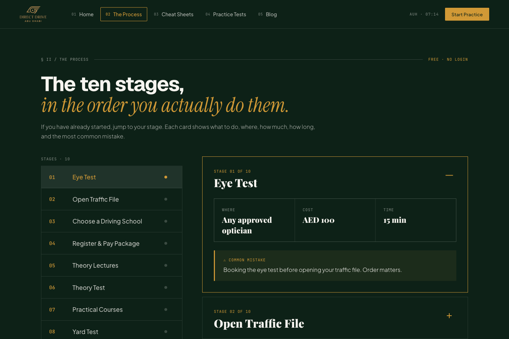
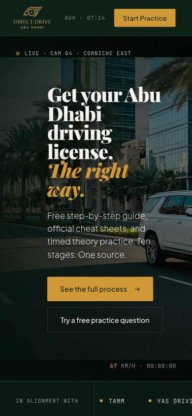

# Direct Drive Abu Dhabi

A static website that brings Abu Dhabi driving-license guidance, study material, and practice questions into one experience. It includes a process overview, study articles, mock exams, and downloadable cheat sheets.

## Preview


<details>
<summary>More previews: license process, practice tests, study references, and mobile</summary>

### License process



### Practice tests


### Study references


### Mobile



</details>

## Pages

- `Wajha.html`: main landing page; `index.html` redirects here.
- `process.html`: driving-license process overview.
- `practice.html`: practice questions and mock exams.
- `cheatsheets.html`: study references and downloadable materials.
- `blog.html`: supporting articles.

## Run locally

Requires Python 3 for the example server and a modern browser.

```bash
python3 -m http.server 8000 --bind 127.0.0.1
```

Open [http://localhost:8000](http://localhost:8000). No package installation or build step is needed to view the site.

## Implementation

React 18 and Babel Standalone load through CDNs. Local components live in `components/`, with shared styles in `styles.css`. The site reads committed question banks, mock exams, and sign data from `data/`.

- `assets/`: branding and visual media.
- `data/roadready/processed/`: browser-ready questions and mock exams.
- `data/driving-pdf/`: traffic-sign reference data.
- `DirectDrive-CheatSheets.pdf`: prebuilt downloadable cheat sheet.
- `scripts/`: optional content-generation utilities.

## Content utilities

With Node.js installed, the existing data utilities can be run from the repository root:

```bash
node scripts/extract-roadready-data.js
node scripts/build-roadready-mock-exams.js
```

The extraction script expects the source chunk referenced in its `CHUNK` constant. The PDF builder, `scripts/build-cheatsheet-pdf.py`, additionally requires Python packages `reportlab` and `Pillow` and an external `/tmp/rules.json` input. These utilities are not required to serve the committed website or PDF.

## Deployment

Publish the repository root as a static site with no build command. Preserve file names and relative asset paths so the landing-page redirect and study pages resolve correctly.
